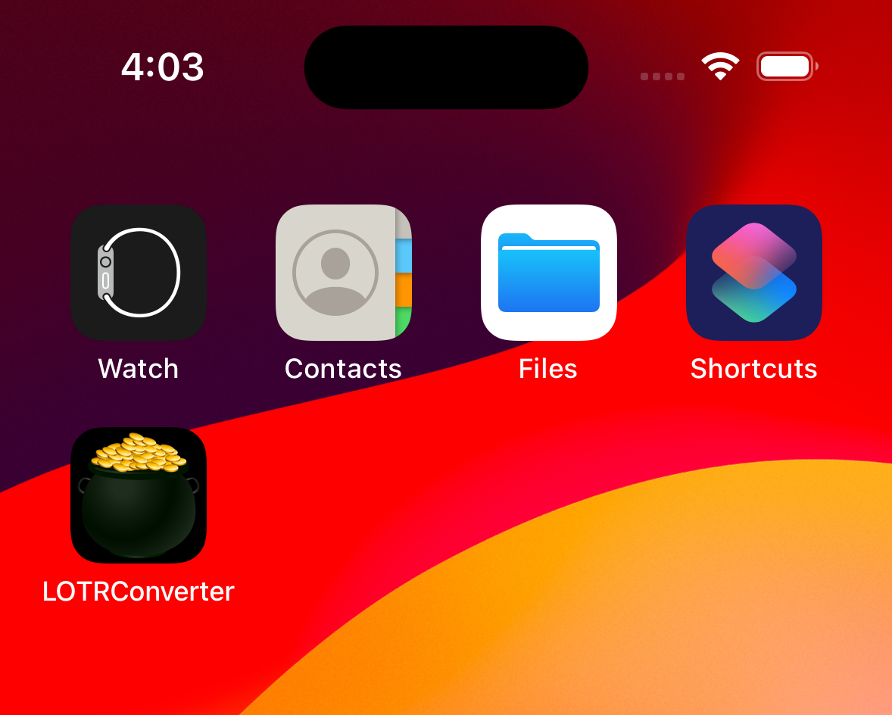
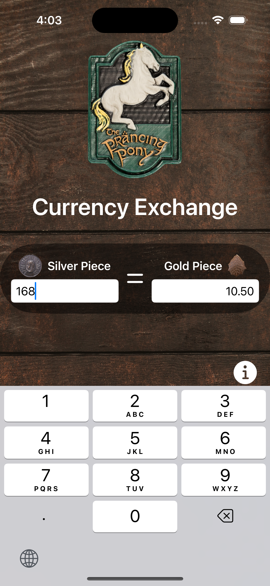
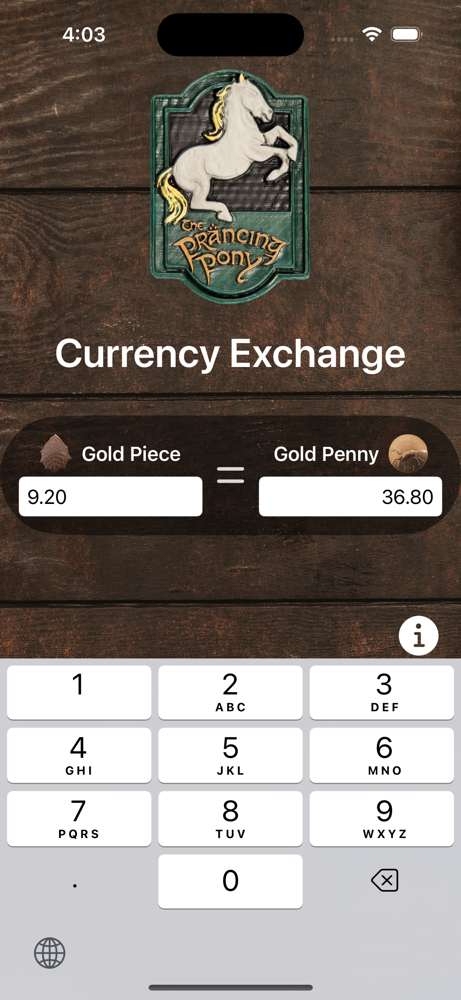

# Lord of the Rings Currency Converter (iOS App)

Built in SwiftUI framework Lord of the Rings (LOTR) Currency Converter app is made for iOS devices.

## Highlights

- Custom app icon

- Tool tips at the time of onboarding

- View currency exchange rates

- Ability to change source/target currencies on fly

- Keyboard decimal input

